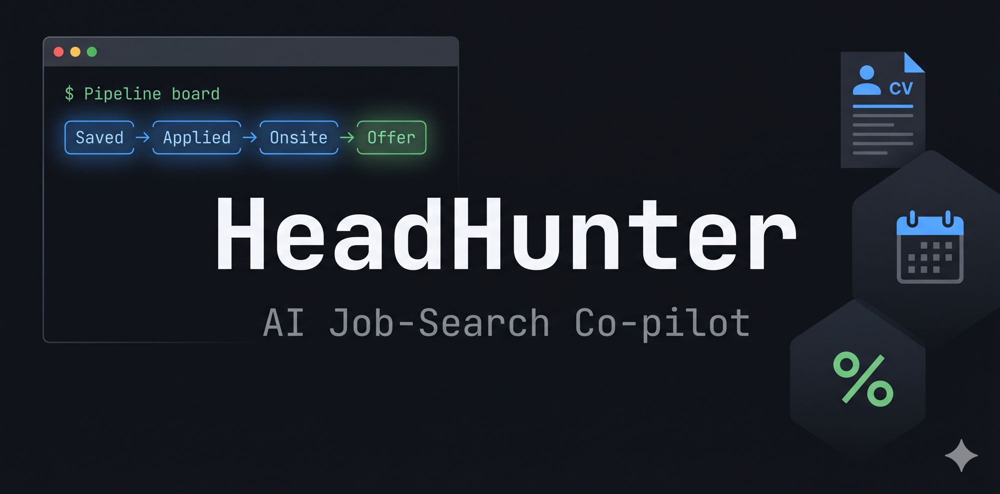

<p align="center">
  
</p>

# HeadHunter — AI Job Search Co-pilot

[](https://github.com/TamirCohen28/headhunter/actions/workflows/ci.yml)
[](LICENSE)
[](https://nodejs.org)

A full-lifecycle job-search assistant: pipeline CRM, interview prep, CV tailoring, job discovery, salary negotiation, network mapping, and analytics — all from your terminal.

Works with **Claude Code**, **Cursor**, and **OpenAI Codex CLI**.  
Requires Node.js ≥ 18. No npm dependencies.

**Storage:** there is no separate database server — all CRM data lives in local JSON under `data/` (see [docs/ARCHITECTURE.md](docs/ARCHITECTURE.md) for the full architecture, pipeline, and integration model).

---

## Install

### Claude Code
```bash
/plugin marketplace add /path/to/headhunter
/plugin install headhunter@headhunter-marketplace
```

### Cursor
Rules auto-load from `.cursor/rules/`. MCP servers load from `.cursor/mcp.json`. Both are included in this repo — open the repo root in Cursor and they're active immediately.

### OpenAI Codex CLI
`AGENTS.md` at the repo root is read automatically by Codex. No install step needed — clone the repo and run `codex` from it.

---

## First run
```bash
node scripts/crud.js seed        # load 5 demo applications
node scripts/candidate-profile.js show   # view your profile (set up with /headhunter:setup)
```

---

## Lifecycle

```
/headhunter:setup     → build your candidate profile (CV, salary, target roles)
/headhunter:discover  → find matching jobs on LinkedIn, AllJobs, Drushim, Indeed
/headhunter:scan      → Match Score + Success Score for any job posting
/headhunter:brief     → full company intel + salary script (ILS) for recruiter screen
/headhunter:apply     → tailored CV (HTML) + cover letter for a specific role
/headhunter:network   → find contacts at target company, draft outreach
/headhunter:research  → study guide (scrape → analyze → OpenAI Deep Research → merge)
/headhunter:mock      → live mock interview with per-answer feedback
/headhunter:insights  → post-interview performance analysis + next-round predictor
/headhunter:negotiate → counter-offer script with market data (ILS)
/headhunter:followup  → draft follow-up emails for stale applications
/headhunter:analytics → pipeline funnel, conversion rates, source performance
```

---

## Commands

| Command | What it does |
|---------|-------------|
| `add-application` | Add a job to the pipeline |
| `pipeline` | Kanban board — move applications between stages |
| `dashboard` | Metrics: response rate, conversion, ghosted %, avg time |
| `calendar` | Upcoming interview agenda |
| `tasks` | View and manage prep tasks |
| `contacts` | Contacts per application |
| `log-interview` | Log an interview round + debrief |
| `search` | Filter applications by any field |
| `settings` | View/edit settings (currency, stale threshold, salary) |
| `status` | Mid-session notification check |
| `cv-review` | ATS score, keyword gaps, bullet improvements, LinkedIn audit |
| `sync` | Trigger Notion / Calendar / Tasks / Todoist syncs |
| `export-data` | Export pipeline to CSV or JSON |

---

## Skills (always loaded)

- **headhunter-core** — CRM operations, offer comparison, search/filter
- **pipeline** — Kanban view and stage moves (read-only)
- **interview-research** — multi-agent study guide pipeline
- **interview-prep** — prep briefs with pre-assessment and study guide integration
- **interview-brief** — Interview Intel: 6-section company briefing with ILS salary script
- **job-scanner** — Match + Success scoring with company selectivity research
- **application-assistant** — tailored CV + cover letter generation (HTML output)
- **cv-optimizer** — ATS scoring, keyword gap analysis, LinkedIn audit
- **mock-interview** — interactive mock session with per-answer evaluation
- **job-discovery** — multi-board job search (LinkedIn, AllJobs, Drushim, Indeed)
- **salary-negotiation** — counter-offer script with market anchoring
- **network-finder** — contact mapping + personalized outreach drafts
- **follow-up** — detect and draft follow-up emails for all three scenarios
- **gmail-status-scan** — classify inbox → detect status changes (with approval gate)
- **integrations** — Notion / Calendar / Google Tasks / Todoist / CSV / reminders
- **scaffold-base44-app** — regenerate Base44 React web app (developer mode)

---

## Documentation

| Doc | Contents |
|-----|----------|
| [docs/user/quick-start.md](docs/user/quick-start.md) | Install → seed → first scan in 5 minutes |
| [docs/user/concepts.md](docs/user/concepts.md) | Pipeline, skills, agents, data model explained |
| [docs/user/troubleshooting.md](docs/user/troubleshooting.md) | Common errors + fixes |
| [docs/ARCHITECTURE.md](docs/ARCHITECTURE.md) | Storage model, system layers, pipelines, MCP vs scripts |
| [docs/engineering/architecture/overview.md](docs/engineering/architecture/overview.md) | Layer breakdown, data flow, design invariants |
| [docs/engineering/decisions/001-local-json-store.md](docs/engineering/decisions/001-local-json-store.md) | ADR: why flat JSON over SQLite/MongoDB |
| [docs/CONTRIBUTING.md](docs/CONTRIBUTING.md) | How to contribute |
| [references/data-model.md](references/data-model.md) | Entity fields and enums |
| [AGENTS.md](AGENTS.md) | Agent/CLI quick reference |

---

## Scripts

| Script | Purpose |
|--------|---------|
| `scripts/crud.js` | Add/update/move/delete/seed all entities; event log |
| `scripts/dashboard.js` | Analytics metrics (`--json` for raw) |
| `scripts/analytics.js` | Funnel with conversion rates, source performance |
| `scripts/calendar.js` | Interview agenda |
| `scripts/timeline.js <appId>` | Per-application chronological timeline |
| `scripts/session-briefing.js` | SessionStart briefing (pipeline + overdue + stale) |
| `scripts/candidate-profile.js` | Manage candidate profile (show/set/extract-cv/reset) |
| `scripts/score-job.js <meta.json>` | Deterministic pre-score for the scanner |
| `scripts/generate-cv-html.js` | Markdown CV → A4 HTML (print to PDF) |
| `scripts/draft-followups.js` | Identify and draft follow-up emails |
| `scripts/save-discovered-jobs.js` | Batch-save discovered job leads (dedup by URL) |
| `scripts/csv-import.js` | CSV → applications (`--url` for remote CSVs) |
| `scripts/export-applications.js` | Export CSV or JSON |
| `scripts/detect-gmail-status.js` | Classify emails → pipeline status |
| `scripts/sync-notion.js` | Applications + tasks → Notion (`--dry-run`) |
| `scripts/sync-todoist.js` | Tasks → Todoist (`--dry-run`) |
| `scripts/sync-google-calendar.js` | Interviews → Google Calendar (`--dry-run`) |
| `scripts/sync-google-tasks.js` | Tasks → Google Tasks (`--dry-run`) |
| `scripts/sync-twilio.js` | WhatsApp reminder digest (`--dry-run`) |
| `scripts/send-stale-reminders.js` | Stale-app digest via Twilio or stdout (`--dry-run`) |
| `scripts/backup.js` | Timestamped JSON snapshot (deduped, max 10) |
| `scripts/pipeline-run.js` | Research dir init / write prompts / batch / finish |
| `scripts/deep-research.js` | OpenAI Deep Research for topic batches (`OPENAI_API_KEY`) |
| `scripts/restore.js <backup>` | Restore from snapshot (`--confirm`) |
| `scripts/validate-data.js` | PostToolUse schema validation |
| `scripts/test.sh` | 21-check self-test suite |

---

## Environment variables

| Variable | Purpose |
|----------|---------|
| `HEADHUNTER_DATA_DIR` | Override data directory (default: `./data` relative to repo root) |
| `NOTION_TOKEN` | Notion MCP / sync |
| `NOTION_DATABASE_ID` | Application → Notion database |
| `NOTION_TASKS_DATABASE_ID` | Task → Notion database |
| `GOOGLE_OAUTH_TOKEN` | Google Calendar + Tasks REST sync |
| `GOOGLE_CALENDAR_ID` | Calendar ID (default: `primary`) |
| `GOOGLE_TASKS_LIST_ID` | Tasks list ID (default: `@default`) |
| `TODOIST_API_TOKEN` | Todoist sync |
| `TWILIO_ACCOUNT_SID` / `TWILIO_AUTH_TOKEN` / `TWILIO_WHATSAPP_FROM` / `WHATSAPP_TO` | WhatsApp reminders |
| `GITHUB_PERSONAL_ACCESS_TOKEN` | GitHub MCP (profile import, company research) |
| `LINKEDIN_EMAIL` / `LINKEDIN_PASSWORD` | LinkedIn MCP (unofficial, opt-in — see below) |
| `OPENAI_API_KEY` | OpenAI Deep Research for topic batches (`deep-research.js`) |
| `OPENAI_DEEP_RESEARCH_MODEL` | Optional: `o3-deep-research` or `o4-mini-deep-research` (default) |

Secrets live in your environment only — never commit them. `data/` and `.env` are gitignored.

---

## MCP servers

Configured in `.mcp.json`. Active by default:

| Server | Package | Purpose |
|--------|---------|---------|
| Gmail | official claude.ai integration | Email scanning + follow-up (authenticate via `/mcp`) |
| Google Calendar | official claude.ai integration | Interview scheduling (authenticate via `/mcp`) |
| Notion | `@notionhq/notion-mcp-server` | Application + task sync (requires `NOTION_TOKEN`) |
| GitHub | `tamirs-superpowers` plugin | Profile import, company research (zero-config via `gh` CLI) |

### LinkedIn MCP (opt-in)

The LinkedIn MCP is an **unofficial community package** that may violate LinkedIn ToS. It is **not included by default**. To enable it, set your credentials in `~/.zshrc`:

```bash
export LINKEDIN_EMAIL=you@email.com
export LINKEDIN_PASSWORD=yourpassword
```

Then add this block to your plugin's `.mcp.json` (find it at `~/.claude/plugins/cache/tamirs-plugins/headhunter/<version>/.mcp.json`):

```json
"linkedin": {
  "command": "bash",
  "args": ["${CLAUDE_PLUGIN_ROOT}/hooks/linkedin-mcp.sh"],
  "env": {
    "LINKEDIN_EMAIL": "${LINKEDIN_EMAIL}",
    "LINKEDIN_PASSWORD": "${LINKEDIN_PASSWORD}"
  }
}
```

---

## Testing
```bash
bash scripts/test.sh           # 21 checks — exercises every core feature
node scripts/crud.js seed      # reset to demo data
```
