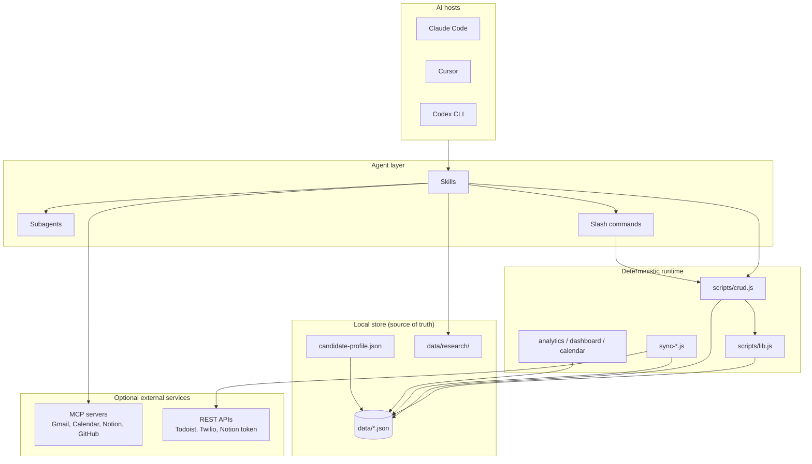
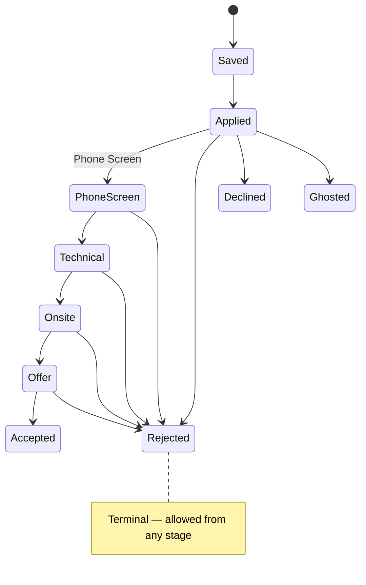

# HeadHunter — Architecture

HeadHunter is a **local-first job-search CRM** driven by Node.js scripts and AI agents (Claude Code, Cursor, Codex). There is **no SQL or document database server** — persistence is plain JSON files on disk.

---

## Storage (“the database”)

| Layer | What it is | Location |
|-------|------------|----------|
| **Primary store** | One JSON file per entity type (array of records) | `${DATA_DIR}/*.json` |
| **Candidate profile** | Single JSON document (not an array) | `${DATA_DIR}/candidate-profile.json` |
| **Research runs** | Prompt + output files per stage | `${DATA_DIR}/research/<slug>/` |
| **Research (legacy)** | Old runs keyed by `app_*` id | `${DATA_DIR}/research/app_<id>/` |
| **Backups** | Snapshot of CRM entity arrays (deduped, max 10) | `${DATA_DIR}/backups/headhunter-backup-<ts>.json` |
| **Generated assets** | Tailored CV HTML, cover letters (paths stored on applications) | Paths on `JobApplication` fields |

**Default data directory:** `./data` relative to the repo root (`CLAUDE_PLUGIN_ROOT` when set by the plugin host).

**Override:** `HEADHUNTER_DATA_DIR` or `settings.json` → `headhunter.dataDir`.

Both `data/` and user secrets are **gitignored** — your pipeline data never ships with the repo.

### Entity files (CRUD via `scripts/crud.js`)

| File | Entity | Access |
|------|--------|--------|
| `applications.json` | Job applications (pipeline cards) | `crud.js` add/update/move/delete |
| `interviews.json` | Interview rounds per application | `crud.js` |
| `tasks.json` | Prep/follow-up tasks | `crud.js` + `complete-task` |
| `contacts.json` | People tied to an application | `crud.js` |
| `notes.json` | Free-form notes | `crud.js` |
| `events.json` | Append-only audit log | **Auto-written** by `crud.js` (do not hand-edit) |

**Rule:** Never hand-edit `data/*.json`. Use `node scripts/crud.js` so validation, `updated_date`, and events stay consistent.

### Optional mirrors (not source of truth)

External systems hold **copies** linked by IDs on records (`notion_page_id`, `todoist_task_id`, `google_calendar_event_id`, etc.). Sync scripts are idempotent — they PATCH using stored IDs instead of creating duplicates.

| Mirror | When used |
|--------|-----------|
| [Base44 web app](../skills/scaffold-base44-app/SKILL.md) | If `VITE_BASE44_APP_ID` + token are set |
| Notion databases | `sync-notion.js` or Notion MCP for ad-hoc edits |
| Google Calendar / Tasks | `sync-google-*.js` or Calendar MCP in chat |
| Todoist | `sync-todoist.js` only (no MCP in this repo) |

Canonical order: **local JSON → optional external mirror**. See [integrations](../skills/integrations/SKILL.md).

---

## High-level system diagram



---

## Application pipeline (job CRM)

Stages are defined in `scripts/enums.js` and enforced by `crud.js move` (forward-only).

### Active pipeline (forward-only)

```
Saved → Applied → Phone Screen → Technical → Onsite → Offer → Accepted
```

- **`move`** only allows advancing along this list (or jumping to a terminal state).
- To **fix a mistaken stage**, use `crud.js update` (patch), not `move`.

### Terminal states (from any active stage)

`Rejected` · `Declined` · `Ghosted`

### Analytics grouping

`ACTIVE_STAGES` = Applied through Offer — used for stale detection, funnel metrics, and follow-up drafts.

Full field definitions: [references/data-model.md](../references/data-model.md).



---

## Interview-research pipeline (study guides)

Separate from the **application status** pipeline. Triggered by `/headhunter:research` (skill: `interview-research`).

Each run uses a **slug directory** (not `app_*`):

```
data/research/nvidia-senior-ai-llm-solutions/
  00_run.json
  01_job_scraper.md / 01_job_description.md
  02_job_analyzer.md / 02_job_metadata.json
  03-research-prompt.md / 03-research-report.md   ← OpenAI Deep Research
  04-research-prompt.md / 04-research-report.md   ← additional batches
  NN-study-guide-prompt.md
  04_study_guide.md                               ← final (printed by finish)
```

CLI: `pipeline-run.js` (init, write, batch, finish) + `deep-research.js` (OpenAI Responses API).

Detail: [references/pipeline-output.md](../references/pipeline-output.md), [references/deep-research-template.md](../references/deep-research-template.md).

---

## Layer responsibilities

| Layer | Role | Examples |
|-------|------|----------|
| **Skills** | Workflow instructions for the agent; when to call scripts/MCP | `headhunter-core`, `job-scanner`, `follow-up` |
| **Commands** | Thin entry points (`commands/*.md`) | `pipeline`, `sync`, `dashboard` |
| **Subagents** | Focused research/interview tasks | `job-analyzer`, `study-guide-writer`, `mock-interviewer` (+ `deep-research.js` for topic batches) |
| **Scripts** | Deterministic I/O: CRUD, sync, scoring, export | `crud.js`, `sync-notion.js`, `score-job.js` |
| **MCP** | Interactive API access in chat | Gmail scan, GitHub profile, Notion browse |
| **Hooks** | React to file writes | `validate-data.js`, `post-research-hook.js` |

**Why both MCP and scripts?** MCPs excel at conversational, one-off operations (read inbox, send one email). Scripts excel at batch sync, `--dry-run`, cron (`send-stale-reminders.js`), and `scripts/test.sh` without an LLM in the loop. Integration logic is specified in [references/server-functions.md](../references/server-functions.md).

---

## Event log and timeline

Every meaningful CRM change appends to `events.json`:

| Event type | Trigger |
|------------|---------|
| `application_created` | New application |
| `status_change` | `crud.js move` (includes `meta.from` / `meta.to`) |
| `interview_added` | New interview round |
| `task_added` / `task_completed` | Task lifecycle |
| `note_added` | New note |

`scripts/timeline.js <appId>` merges events, scheduled interviews, and notes into one chronological view.

---

## Directory layout

```
headhunter/
├── data/                          # gitignored — your CRM (JSON + research)
│   ├── applications.json
│   ├── interviews.json
│   ├── tasks.json
│   ├── contacts.json
│   ├── notes.json
│   ├── events.json
│   ├── candidate-profile.json
│   ├── research/<slug>/           # interview-research runs (see pipeline-output.md)
│   └── backups/                   # CRM snapshots (deduped)
├── scripts/
│   ├── crud.js                    # entity CRUD + move + seed
│   ├── pipeline-run.js            # research init / write / batch / finish
│   ├── deep-research.js           # OpenAI Deep Research (topic batches)
│   ├── lib.js                     # load/save, DATA_DIR, CSV helpers
│   ├── enums.js                   # pipeline + validation enums
│   └── sync-*.js, analytics.js, …
├── skills/                        # agent workflows
├── agents/                        # subagent prompts
├── commands/                      # slash-command docs
├── references/                    # schemas & integration specs
│   ├── data-model.md
│   ├── pipeline.md
│   ├── pipeline-output.md
│   ├── deep-research-template.md
│   └── server-functions.md
├── settings.json                  # defaults (currency, stale days, research)
├── .cursor/mcp.json               # MCP server definitions (Cursor)
└── AGENTS.md                      # agent quick reference
```

---

## Configuration

| Source | Purpose |
|--------|---------|
| `settings.json` | `headhunter.defaultCurrency`, `staleThresholdDays`, `research.*` |
| Environment | `HEADHUNTER_DATA_DIR`, integration tokens (see README) |
| `scripts/enums.js` | Pipeline order and allowed enum values |

---

## Security and data integrity

- **No `npm install`** for core CRM — reduces supply-chain surface on files that hold your job search.
- **Deletes** require `--confirm` on `crud.js delete` and `restore.js`.
- **Outbound integrations** should use `--dry-run` first (Notion, Todoist, Twilio).
- **Validation:** `scripts/validate-data.js` (hook) checks JSON shape after writes.

---

## Related documentation

| Doc | Contents |
|-----|----------|
| [references/data-model.md](../references/data-model.md) | Field-level schema for all entities |
| [references/pipeline-output.md](../references/pipeline-output.md) | Pipeline run folder layout and CLI |
| [references/pipeline.md](../references/pipeline.md) | Interview-research stages and JobMetadata |
| [references/server-functions.md](../references/server-functions.md) | Integration triggers and idempotent sync rules |
| [references/candidate-profile-schema.md](../references/candidate-profile-schema.md) | Profile used by scanner, apply, negotiate |
| [references/status-config.md](../references/status-config.md) | Gmail classification patterns |
| [AGENTS.md](../AGENTS.md) | CLI cheat sheet for agents |

---

## Self-test

```bash
bash scripts/test.sh    # 21 checks against a temp data dir
node scripts/crud.js seed
```

Ensures CRUD, pipeline rules, timeline, dashboard JSON, export round-trip, and related behavior against the JSON store.
